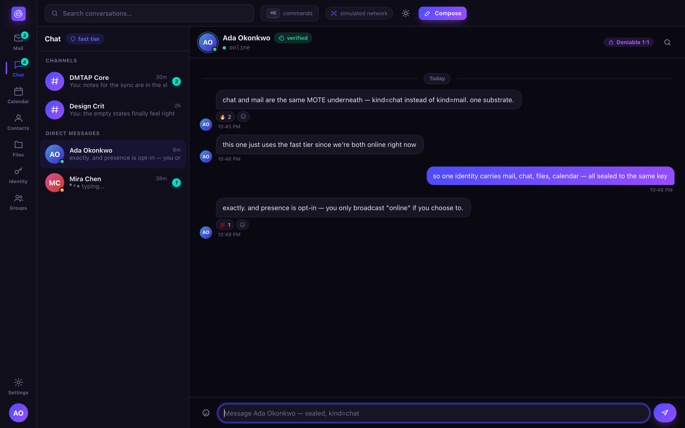

# Chat

DMs and channels over the same MOTE substrate as mail — just `kind = chat` on the faster tier.
Channels are simply **groups with addresses** (see [identity.md](identity.md#groups-as-identities)).

## The honest protocol badge

Every conversation header states plainly which cryptographic mode it's using, because the two
available modes make genuinely different tradeoffs and Envoir doesn't paper over the difference:

- **Deniable 1:1** — a pairwise X3DH/PQXDH handshake + Double Ratchet, authenticated by a
  shared-key MAC. No signature ever ties a message to you: either party could have produced any
  given transcript, so neither can prove authorship to a third party. See
  [privacy.md](../privacy.md#deniability-is-optional-and-11-only) for exactly what this does and
  doesn't protect against.
- **MLS group · signed** — the default for channels and any group of three or more. Scales to any
  group size and gives strong forward secrecy and post-compromise security, but every message is
  signed and therefore **non-repudiable** — this is an inherent property of MLS (RFC 9420), not a
  missing feature.

Clicking the badge in the client shows the tradeoff in full; the deniable mode is always an
**explicit, per-conversation choice**, never a silent default, and the client never silently falls
back to deniable-off if your counterpart hasn't advertised support for it — you're told and asked,
not quietly downgraded.

## Why deniability needs its own mode

MLS's forward secrecy and post-compromise security come from a signed ratchet tree — signatures
that make every message attributable by design (RFC 9420 says outright that MLS makes no
deniability claims). Rather than weaken MLS's signatures to fake deniability (which would break
its own security proof), Envoir runs a **separate, proven** protocol beside the 2-member MLS group
when you opt in: the same Signal-style X3DH/PQXDH + Double Ratchet construction Signal itself
uses, reusing existing, audited cryptography instead of inventing something new. Both handshake
and repudiation are formally verified — see
[security.md](../security.md#formal-proverif-models).

**What it doesn't protect against:** a device that logs its own plaintext as displayed still
proves content, regardless of any repudiation protocol — deniability is about the cryptographic
transcript, not about a compromised or coerced endpoint. One-way threads (send-only, no reply
ever) don't get post-compromise healing until a reply flows, because that healing needs a fresh
contribution from the other party's ratchet step.

## Groups, roles, and posting models

A group has its **own keypair** and its own address on the naming ladder (`team@company.com`,
`@core`, or a bare key), and two posting models:

- **Broadcast / list** — post to the address, every member gets a copy; membership is typically
  hidden from other members (a distribution list, an announce channel).
- **Collaborative / channel** — a shared, ordered conversation; membership is typically visible to
  members.

Roles (`owner`, `admin`, `member`, optional `poster`/`reader`) gate management operations
(add/remove members, change policy), and every such change is signed and appears in the group's
own audit trail — so "who added/removed whom" is always answerable. A group's own signing key is
threshold-held by its admin set, so no single admin (and no ordering node) can unilaterally hijack
the group's address.

## Presence and typing

Opt-in and off by default, because they're metadata-sensitive — Envoir doesn't turn on a signal
that reveals when you're active unless you've asked for it.
