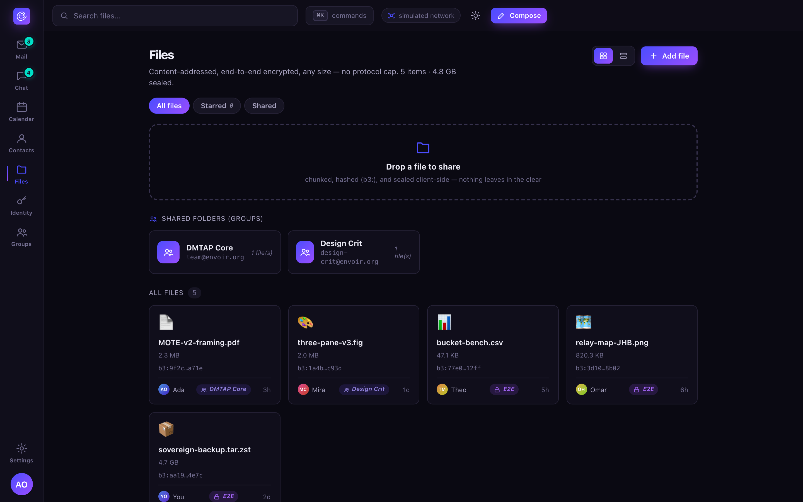

# Files

Content-addressed, end-to-end encrypted, any size — no protocol cap, bounded only by your own
storage. A shared folder **is** a group: drop a file, and everyone with membership can read it.

## How it works

A file is a **BLAKE3 Merkle-DAG manifest** over fixed-size encrypted chunks:

- **Any size** — the manifest lists chunk hashes; the file itself is bounded only by storage,
  never by the protocol.
- **Resumable, parallel, swarmed** — fetch chunks from any holder, restart per chunk,
  BitTorrent-style; a popular file gets *more* available as more nodes hold it, not less.
- **Deduplicated** — identical chunks (and identical whole files) are stored once, by content
  address.
- **Streamable** — a client can consume a file in manifest order before the full download
  completes.
- **Self-verifying** — every chunk checks against its own hash, and the manifest checks against
  its own content address, so corruption or tampering is caught, not silently served.

## Where the key lives (and why it doesn't live in the manifest)

The manifest itself is a content-addressed blob that any holder in the swarm serves to anyone who
asks for the chunk list — so if the file's decryption key were embedded in the manifest, every
holder could read the file it's merely relaying. Instead, the file's content key travels **only
inside the sealed MOTE** that announces the file, visible only to the recipient(s). Chunks are
served **blind**: a holder can relay encrypted chunks and the manifest without ever being able to
read the file.

## Size tiers and where privacy trades off

| Tier | Size (v0 defaults) | Path | Metadata privacy |
|---|---|---|---|
| Inline | ≤ 64 KiB after padding | Inside the MOTE itself | Full — rides the message's own privacy tier |
| Normal | Up to ~4 MiB | Manifest in the MOTE; chunks *also* routed through the mixnet | Full — same guarantee as messages |
| Large | Above that | Manifest in the MOTE; chunks via the direct/fast onion-routed bulk path | Weaker, Tor-class — the *fact and approximate size* of a large transfer is more observable than a message |

This tiering is deliberate, not an oversight: routing every large file through the same slow,
low-bandwidth mixnet as messages would be impractical, so bulk chunk transfer trades some
metadata protection for the bandwidth a large file actually needs. Small and normal-sized
attachments keep the full guarantee. See [privacy.md](../privacy.md) for the underlying tier
model.

## Availability

| Tier | Mechanism | Cost |
|---|---|---|
| Best-effort | Origin node online + swarm from holders | $0 |
| Durable | Encrypted peer-cache / replica among your own devices or peers | Peer reciprocity |
| Always-available | A paid replica or managed host | Real storage cost |

An always-on node gives you best-effort and durable availability for free; "Dropbox-like, always
reachable" for a large file is exactly where a paid replica becomes worth it — and exactly the
kind of thing an optional hosted operator (never a required one) can sell without touching the
protocol's privacy guarantees. See [self-hosting.md](self-hosting.md).

## Shared folders are groups

There's no separate "sharing" primitive: a shared folder is a group over a set of manifests,
using the exact same MLS machinery, roles, and membership model as a chat channel — see
[chat.md](chat.md#groups-roles-and-posting-models). Removing someone from the folder's group
triggers a re-key of every file they had access to, by default, so a removed member doesn't
retain silent access to future changes (though anything they already downloaded, they already
have — no deletion protocol can retroactively un-share bits a device already copied).
