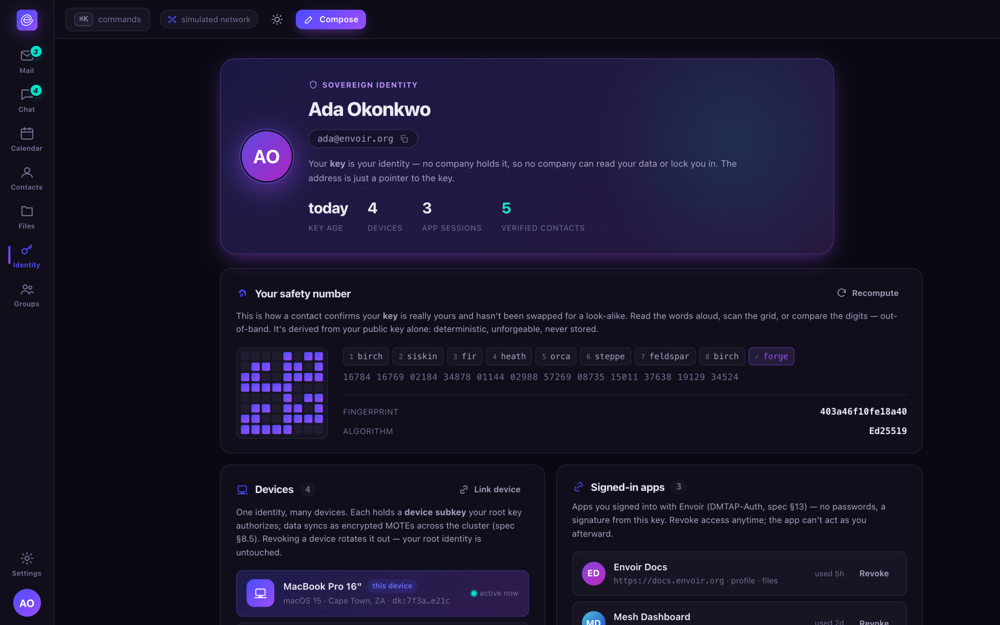

# Identity

Your key is the security boundary. Everything else — your address, your provider, your IP — is a
replaceable pointer to it.

## The key hierarchy

An identity is rooted in a long-term root identity key, held cold and used rarely. Day-to-day,
each of your devices carries its own signed device subkey — phone, laptop, the always-on box — so
compromising one device doesn't hand over the root key, and revoking a device is a targeted,
cheap operation rather than a full identity rotation. Where the platform allows it, device keys
live in a hardware keystore (Secure Enclave, TPM, StrongBox, TEE) as non-exportable keys, so even
a software compromise of the device can only *use* the key while it's unlocked, never copy it out.

## Addresses are pointers, not the identity

What you give out is a **primary address** — `name@domain`, e.g. `you@envoir.org` or your own
domain. One identity may hold several addresses at once: aliases, a kept legacy address (so
switching to Envoir doesn't mean abandoning an old inbox), an optional `@handle`, and
plus-addressing (`you+tag@domain`) — all resolving to the same key. If you lose the domain, you
lose the *name*, not the identity: a signed move record rebinds the same key to a new name, and
existing contacts (who route by key, not by name, once you've made first contact) follow you
automatically. See [protocol.md](../protocol.md#naming--key-transparency).

## Safety numbers

A safety number is a deterministic fingerprint of an identity's full keyset — rendered as words,
digits, or a scannable QR-style grid, exactly like Signal's. Two contacts compare it out-of-band
(in person, over a trusted channel, or by scanning) to upgrade a trust-on-first-use pin to a
verified one. This is the one thing that closes the gap TOFU leaves open: a look-alike key
substituted at the very first contact, before either side has verified anything.

A **verified ✓** badge in the client means you did this comparison. It is computed over the entire
identity object (every algorithm suite the identity holds), not a single key, specifically so a
rogue additional key injected later can't hide behind a pin you only checked against the original
one — adding a key changes the safety number and downgrades a verified pin back to unverified
until you re-check.

The 8-word encoding is **a verification affordance, not an address** — it is never something you'd
give someone to reach you, only something you'd read aloud to confirm a key.

## Recovery

Recovery is a first-class, versioned, signed policy you compose from phrase, additional-device,
and social-guardian factors, with two deliberately different thresholds — a lower bar for
recovering access, a higher bar for changing the recovery policy itself, so a single recovered or
compromised factor can never rewrite the rules and lock you out. See
[privacy.md](../privacy.md#recovery-phrase-device-and-social-guardians) for the full model,
including its one honest, unavoidable limit.

## Groups as identities

A group is simply an identity that has members — its own keypair, its own address on the same
naming ladder as a person. See [chat.md](chat.md#groups-roles-and-posting-models) and
[files.md](files.md#shared-folders-are-groups).

## Signing in with your key — DMTAP-Auth

The same keypair that receives your mail can log you in to the web, with no central identity
provider in the middle:

1. A relying party shows "Sign in with DMTAP" and issues a challenge naming its own origin.
2. A trusted client on your side (a browser using WebAuthn, or your own signed-in Envoir app)
   binds and displays the *verified* origin, and your key signs a challenge that includes it.
3. The relying party verifies the signature against your pinned key, checks the origin matches
   its own, and binds the resulting session only to a fresh, per-relying-party session key —
   never to your root key directly.

Phishing resistance comes entirely from that origin-binding step being enforced by a trusted
client component, not by trusting whatever origin string a remote party claims. For legacy sites
that only speak OIDC/OAuth, a bridge translates DMTAP-Auth into a standard ID token; the bridge is
a convenience operator you can swap or self-host, not a requirement, and its importance fades as
native support spreads. See spec §13 for the full ceremony and its stated honest limits (a
compromised bridge is a trusted third party exactly like any classical identity provider — only
the native path removes that trust entirely).

## Multi-device

Your devices form your own personal MLS group, syncing the mailbox, flags, labels, and file index
as an encrypted CRDT over the mesh. Any device can send or receive; your always-on box is the
anchor that guarantees receipt while your other devices sleep.
