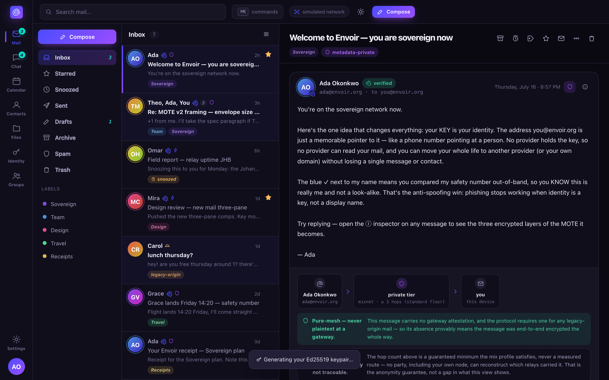

# Transport-Path Provenance

Every message you receive carries a recipient-only, verifiable record of **which trust boundaries
it crossed** on its way to you — without weakening the mixnet's anonymity guarantee or revealing
anything a mixnet intermediary shouldn't see.

## What you can learn about a message

- **Which tier it arrived on** — the metadata-private `private` tier (mixnet + cover traffic) or
  the faster, direct `fast` tier. This is something your own node *observed* at receipt, not a
  claim the sender made.
- **Whether it's pure-mesh or gateway-touched.** A message that transited a legacy gateway carries
  that gateway's cryptographic attestation, sealed inside the encrypted payload — so it's visible
  to you and only you. A native DMTAP↔DMTAP message carries no such attestation at all, which
  means it was **provably never plaintext at any gateway**, end-to-end the whole way. There is no
  third, unmarked state where legacy plaintext could sneak in disguised as pure-mesh — the
  attestation is mandatory for any accepted legacy-origin mail.
- **A coarse hop descriptor for the private tier** — which *profile floor* the message satisfied
  (at least 3 hops under the standard profile, at least 5 under the high-security profile), and
  nothing more specific than that.

## What you deliberately cannot learn — and why that's the point

The provenance record never names an individual mix node, an exact hop count beyond the profile
floor, a path, or per-hop timing. This isn't a missing feature: the mixnet is *designed* so that
no party — including your own node — can reconstruct the path a private-tier message took. A
record that could reveal more than "this satisfied the standard/high-security profile" would be
leaking the exact thing the mixnet exists to hide. Provenance answers "which trust boundaries did
this cross?" — never "which nodes carried it?"

The gateway attestation itself (the gateway's identity, receipt time, and the original legacy
sender address) travels sealed inside the encrypted payload, so it's visible only to you — never
to a mixnet intermediary. And the provenance record as a whole never leaves your own devices: it's
served only over your own authenticated client connection, never attached to a forwarded message
or shown to anyone else.

## Rendering the path

The client draws a simple graph: `sender -> tier (coarse hop count) -> gateway (if any) -> you`.
A pure-mesh message renders as unmistakably end-to-end; a gateway-touched message renders with the
named gateway, its receipt time, and (for inbound legacy mail) the original sender — clearly
marked as *not* end-to-end before the gateway crossing. Chained multiple-gateway paths (uncommon)
render as ordered hops, with any hop under an untrusted domain flagged as unverified. While the
mix fleet is small, the client never overclaims "anonymous" in absolute terms — see
[privacy.md](../privacy.md).

## Why this matters for billing

Because gateway attestation is mandatory and cryptographically verifiable, a message's own
provenance record is the same thing an operator would bill against — see
[self-hosting.md](self-hosting.md#billing-is-tied-to-the-gateway-only). A pure-mesh message can
never legitimately appear on a gateway bill, and you can independently confirm that any billed
legacy operation corresponds to a real message that actually used the gateway, rather than taking
an invoice line item on faith.
